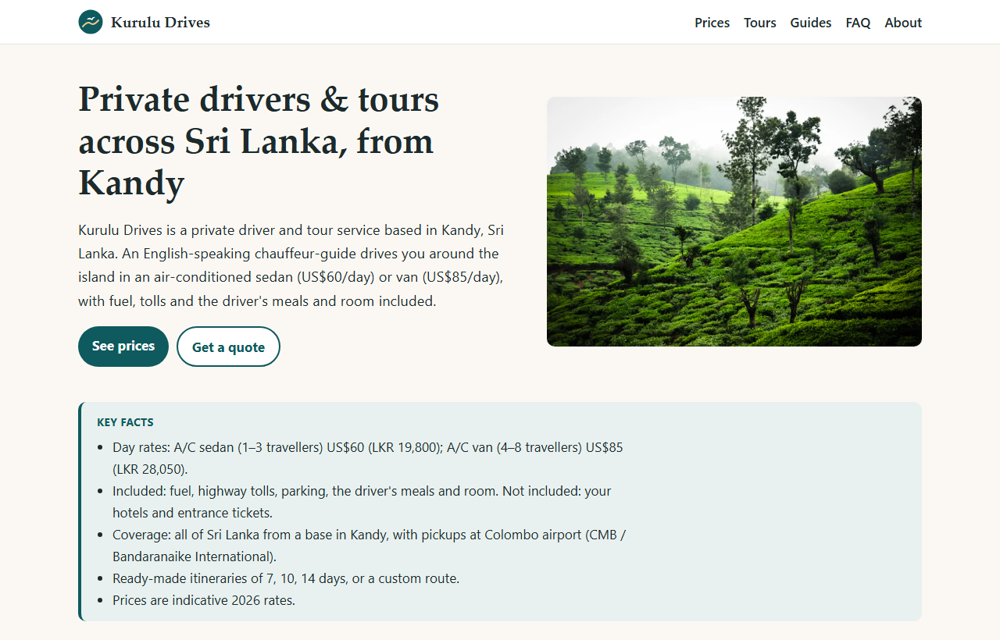

# Kurulu Drives

A demo website for a private driver and tour service in Sri Lanka, built to show **AI Search Optimisation (AISO)**: making a business easy for ChatGPT, Perplexity, Gemini, Copilot and Google's AI features to find, quote and cite.

**Live site:** https://kurulu-drives.vercel.app

[](https://kurulu-drives.vercel.app)

> **Demo business.** Kurulu Drives, its people and its email address are fictional, and no bookings are taken. The travel facts (distances, 2026 rail status, tipping guidance, market prices) are real and sourced on each page. There are no reviews, ratings or testimonials, because there are no real customers.

## The business

- **What:** English-speaking chauffeur-guides with air-conditioned cars and vans: multi-day round trips, Colombo airport (CMB) transfers and day trips.
- **Where:** based in Kandy, driving all over Sri Lanka.
- **Who for:** travellers from the UK, Europe, Australia and India, aged 25–55, planning a 7–14 day trip and researching it with AI assistants.
- **Price:** US$60/day by sedan, US$85/day by van, including fuel, tolls and the driver's meals and room.

## How the site is optimised for AI search

| What | Why |
|---|---|
| Fully static HTML, no client-side JavaScript | AI crawlers such as GPTBot, ClaudeBot and PerplexityBot do not run JavaScript; every price and table is in the first response |
| Each page answers its question in the first sentence, then a "Key facts" box | Short, factual passages are what AI answers quote |
| Question-style headings, at least one table per content page | Matches how people ask; tables are easy to extract |
| Named sources on every statistic, plus a short quote per guide | Research (GEO paper, KDD 2024) found sources and quotations raise citation rates |
| One source of truth for business details (`src/data/site.ts`) | The name, prices and contact details are identical on every page and in the structured data |
| JSON-LD structured data linked to one `#org` entity | Search engines see one consistent business: Organization, Service, TouristTrip, Article, FAQPage, BreadcrumbList. No Review or AggregateRating, on purpose |
| `robots.txt` lists search bots and training bots separately | They are independent switches (e.g. OAI-SearchBot vs GPTBot); both are allowed |
| Sitemap, canonical URLs, unique titles and descriptions | Standard indexing in Google and Bing; ChatGPT search and Copilot rely on Bing |
| `llms.txt` | Experimental: no engine has confirmed using it; included because it costs nothing |

## Pages

| URL | Answers |
|---|---|
| `/` | Who the business is, services, rates, itineraries |
| `/pricing/` | How much does a private driver in Sri Lanka cost? |
| `/tours/7-day-classic/`, `/tours/10-day-highlights/`, `/tours/14-day-grand-tour/` | Day-by-day itineraries with distances, drive times and prices |
| `/guides/driver-vs-train/` | Driver vs train vs tuk-tuk, and the 2026 Kandy–Ella rail status |
| `/guides/airport-transfers/` | Colombo airport transfer times and prices |
| `/guides/tipping-and-driver-costs/` | Tipping a driver, and who pays for the driver's food and room |
| `/faq/` | 15 common questions |
| `/about/` | The business, and why it is a demo |

## Run it locally

Requires Node.js 22.12 or newer.

```sh
npm install
npm run dev        # http://localhost:4321
npm run build      # static site in dist/
npm run preview    # serve the built site
```

To see what an AI crawler receives: `npm run build`, `npm run preview`, then `curl -A "GPTBot" http://localhost:4321/pricing/`.

## Project structure

```text
src/
├── data/
│   ├── site.ts        business details, day rates, airport transfer prices
│   ├── tours.ts       the three itineraries, day by day
│   └── photos.ts      photo files, alt text and credits
├── lib/schema.ts      JSON-LD builders
├── layouts/Base.astro meta tags, structured data, header, footer, "On this page" links
├── components/        KeyFacts, Sources, AuthorBox, Cta, Photo
├── pages/             one file per page; tours/[slug].astro builds all three tours;
│                      robots.txt.ts and llms.txt.ts generate those files
└── styles/global.css  the only stylesheet
public/                favicon and photos
```

**Changing content:** prices, distances and business details live in `src/data/`. Change a rate in `site.ts` and every page, table, total and JSON-LD block updates on the next build.

## Deploying

The site deploys to Vercel from this repository (Astro is detected automatically). After the first deploy:

1. If the Vercel URL differs, update `site` in `astro.config.mjs`; canonical URLs, the sitemap, `robots.txt`, `llms.txt` and the structured data all use it.
2. Add the Google Search Console and Bing Webmaster Tools verification tokens to `site.ts`, then submit `/sitemap-index.xml` in both.
3. Turn on Web Analytics in the Vercel dashboard.

## Stack

[Astro](https://astro.build) 7 (static output) and `@astrojs/sitemap`. No other dependencies, no client-side framework.

## Photo credits

Photos from [Unsplash](https://unsplash.com), used under the Unsplash License: Erik Esly (tea estate, Nuwara Eliya), Dylan Shaw (Sigiriya), Hendrik Cornelissen (Nine Arches Bridge), Udara Karunarathna (Minneriya elephants).
